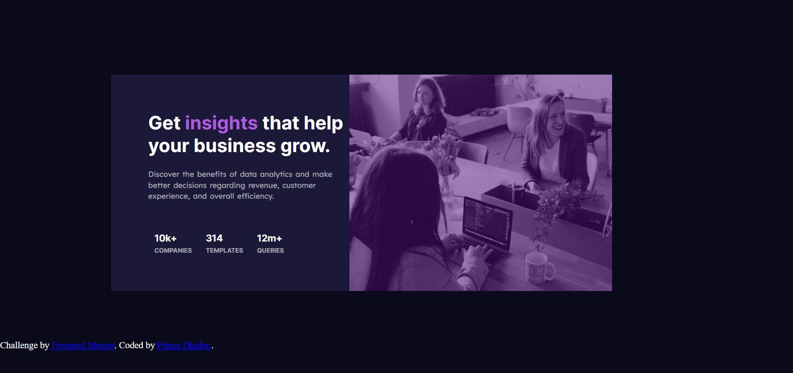

# Frontend Mentor - Stats preview card component solution

This is a solution to the [Stats preview card component challenge on Frontend Mentor](https://www.frontendmentor.io/challenges/stats-preview-card-component-8JqbgoU62). Frontend Mentor challenges help you improve your coding skills by building realistic projects. 

## Table of contents

- [Frontend Mentor - Stats preview card component solution](#frontend-mentor---stats-preview-card-component-solution)
  - [Table of contents](#table-of-contents)
  - [Overview](#overview)
    - [The challenge](#the-challenge)
    - [Screenshot](#screenshot)
    - [Links](#links)
  - [My process](#my-process)
    - [Built with](#built-with)
    - [What I learned](#what-i-learned)
    - [Continued development](#continued-development)
    - [Useful resources](#useful-resources)
  - [Author](#author)


## Overview

### The challenge

Users should be able to:

- View the optimal layout depending on their device's screen size

### Screenshot




### Links

- Solution URL: [Add solution URL here](https://your-solution-url.com)
- Live Site URL: [Add live site URL here](https://your-live-site-url.com)

## My process

### Built with

- Semantic HTML5 markup
- CSS custom properties
- Flexbox
- CSS Grid


### What I learned
During the course of this project,  I was able to learn and try out some cool html and css properties which I haven't tried before:
-I was able to manipulate the color of an image
-I was also able to learn abit about media queries.

 Here are some code samples of areas I would love to highlight to reinforce my  knowledge.


```css
.bdy .img{
        width: 86.5%;
        height: 3vh;
        background-position: center;
        background-size: cover;
        position: relative;
        left: 55%;
        top: 0%;
    }
    .bdy .img::before{
        content: '';
        position: absolute;
        height: 70vh;
        width: 70%;
        background:hsla(277, 84%, 27%, 0.5) 
      }


### Continued development

There are some areas that I would want to continue focusing on in future projects. Some concepts I'm still not completely comfortable with and find useful that I would love to refine and perfect are the css media queries and the css flexbox.

### Useful resources

- (https://youtu.be/69IbzTWg5PM?si=RWgtGTm7ULuflMit) - This helped me to understand media queries abit . I'd recommend it to anyone still learning this concept.


## Author

- Website - [Add your name here](https://www.your-site.com)
- Frontend Mentor - [@Prince-Okafor](https://www.frontendmentor.io/profile/Prince-Okafor)
- Twitter - [@PrinceOkafor_](https://www.twitter.com/PrinceOkafor_)

